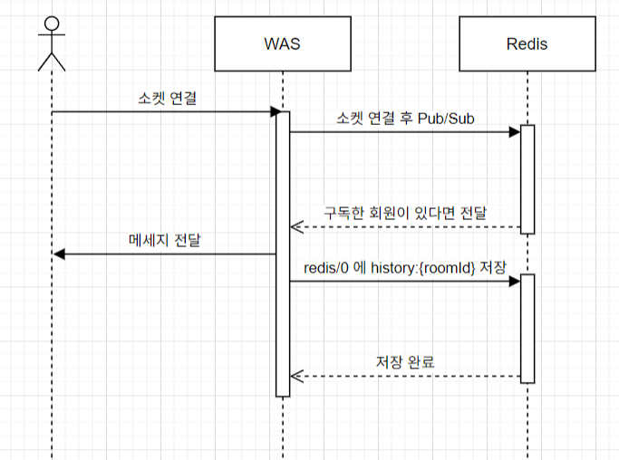
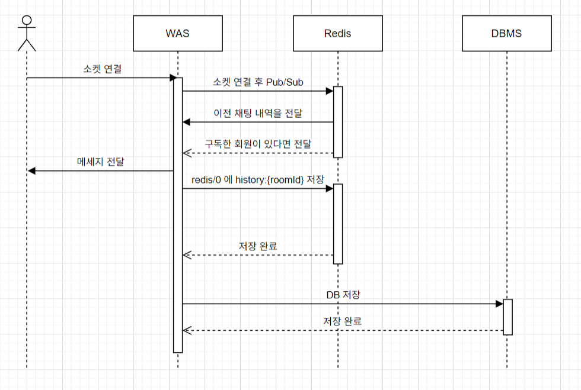

### 캐싱 전략

- 메세지를 Redis를 활용하여 Pub/Sub으로 전송
- 받은 메세지를 Redis에 저장



해당 방식은 Redis 에 전달한 메세지를 저장하며, 새로 해당 채팅방에 접속한 유저에게 이전 메세지를 전달합니다. 
- Redis에 저장된 메세지를 가져오는 방식은 Redis의 `LRANGE`를 활용하며 한개의 채팅방에 100개만 저장하여, 가져옵니다.

```java
// 2) 룸별 채팅 기록을 왼쪽으로 push하고, 최대 100개까지만 보관
ListOperations<String, ChatMessage> ops = redisTemplate.opsForList();
String historyKey = "chat_history:" + message.getRoomId();
ops.leftPush(historyKey, message);
ops.trim(historyKey, 0, MAX_HISTORY_SIZE - 1);
```

저장, 조회에는 빠른 성능을 보이지만, 데이터 관리에는 어려움이 있습니다. 이에 Redis에 저장하는 데이터를 DB에 저장하는 방식으로 변경할 수 있습니다.

캐싱 읽기, 쓰기에는 다양한 전략이 존재합니다. 해당 내용은 [InpaDev](https://inpa.tistory.com/entry/REDIS-%F0%9F%93%9A-%EC%BA%90%EC%8B%9CCache-%EC%84%A4%EA%B3%84-%EC%A0%84%EB%9E%B5-%EC%A7%80%EC%B9%A8-%EC%B4%9D%EC%A0%95%EB%A6%AC) 에 정리되어 있기 때문에 추가적인 설명은 생략하겠습니다.
캐싱 전략은 크게 5가지로 나눌 수 있습니다.

읽기 전략
1. Cache Aside
2. Read Through

쓰기전략
3. Write Behind
4. Write Through
5. Write Around

채팅 서비스에서 읽기는 해당 채팅방 이전 내용을 가져오는 것입니다. 카카오와 같은 서비스는 정합성이 중요하나, 
해당 서비스는 정합성이 중요하지 않기 때문에, Cache Aside 전략을 사용합니다.
읽기 시 Redis에 저장된 메세지를 가져오고, 필요 시 DB에서 가져오는 방식으로 구현합니다.

쓰기 전략은 Write Through 전략을 사용합니다. 메세지를 Redis에 저장하고, DB에 저장하는 방식입니다.

```java
public void publish(ChatMessage message) {
    // 1) 메시지를 JSON 문자열로 변환해 토픽으로 발행
    redisTemplate.convertAndSend(topic.getTopic(), message.toJson());

    // 2) 룸별 채팅 기록을 왼쪽으로 push하고, 최대 100개까지만 보관
    ListOperations<String, ChatMessage> ops = redisTemplate.opsForList();
    String historyKey = "chat_history:" + message.getRoomId();
    ops.leftPush(historyKey, message);
    ops.trim(historyKey, 0, MAX_HISTORY_SIZE - 1);

    // 3) 비동기 MySQL 영속화
    persistenceService.persist(message);
}
```



### 한계
해당 방식은 Cache Aside + Write Through 전략을 사용합니다. 하지만 사진과 같이 Redis에 지나치게 의존하게 됩니다.

Redis에 Pub/Sub 기능과 저장, 조회 등 많은 부분이 의존되어 있기 때문에 Redis에 장애가 발생할 경우, 서비스에 큰 영향을 미칠 수 있습니다.

이러한 문제를 해결하기 위해서는 Redis에 의존하지 않는 구조로 변경해야 합니다.

1. DB를 항상 거치는 Read Through, Write Through, Write Around 전략을 사용합니다.
2. Redis와 WAS의 결합도를 낮추는 3th party 라이브러리(ex. Kafka)를 사용합니다.
3. Redis 클러스터를 구성하며, Redis HA 기능을 활용하여 장애를 대비합니다.

3가지 방법이 존재하지만, 2, 3번 방법은 비용적인 측면이 크기 때문에 1번이 추후 개선 방향으로 적합합니다.
